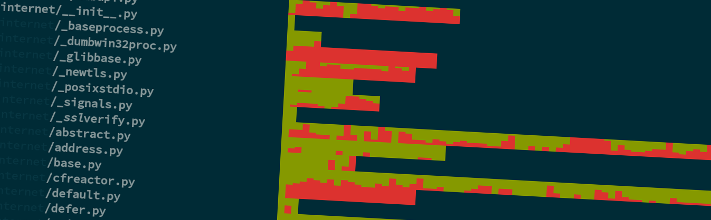
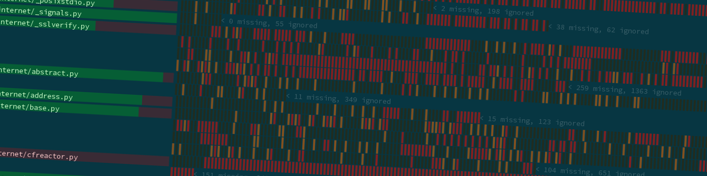

Cuv'ner
=======

"A commanding view of your test-coverage"

The command-line tool ``cuv`` provided by this package gives some
useful tools to visualize your project's coverage data. This means you
must first run `coverage`_ against your project's test-suite.

Once you have a ``.coverage`` file, you can use the commands
documented below (or just type ``cuv`` to explore the help).

We utilize several quality open-source packages to achieve this:

 - `coverage`_ by Ned Batchelder
 - `Click`_ by Armin Ronacher
 - `pygments`_
 - `ansicolors`_
 - `Pillow`_
 - `svgwrite`_
 - `Source Code Pro`_: the best programming font

.. image:: ../screenshots/cuvner-lessopen-twisted.png
    :alt: pygments + coverage coloring in console

Code: https://github.com/meejah/cuvner
Docs: https://cuvner.readthedocs.org

Background + Terminology
------------------------

This started out as some experiments in "whole-project coverage
visualization", and then also grew some console tools that I find
useful when working with Python code. There are a few hack-job
proof-of-concept visualizations in the works as well.

Modern MacBooks have resolution up to 2880x1800, and 4k displays can
be something like 3840x2160 -- I thought it might be interesting to
try and view the coverage of a "whole project at once". Some of these
experiments can be seen with ``cuv pixel``.

Whenever I say "line", I mean a "statement" as defined by coverage.py
-- this just means we ignore all comments and other non-code lines in
the visualizations. So, each file will usually appear to have far
fewer total lines than if you ran ``wc`` or ``ohcount`` against it.

Although I've done some code-cleanups and rudimentary testing, this
"works for me" but might not "work for your setup" ;)

As far as my setup, I am using Debian with a 256-color and unicode
capable shell using Solarized Dark color schemes. There are probably
bugs with other setups, and to a reasonable extent I'm happy to accept
pull-reqeusts fixing these. That said, a unicode-capable shell is a
must.

Other Neat Visualizations
~~~~~~~~~~~~~~~~~~~~~~~~~

Other nice "coverage visualization" tools I've run across:

- of course, `Coverage.py
  <http://coverage.readthedocs.org/en/latest/>`_ itself comes with a
  nice HTML visualization
- `emacs-coverage <https://github.com/trezona-lecomte/coverage>`_
- `codecov.io browser extension
  <https://github.com/codecov/browser-extension>`_ shows coverage live
  while browsing github

Notes on Tox
------------

If you're using `tox`_ to run tests (and you should, it's great!) your
coverage files will -- depending upon setup -- end up in
``.tox/envname/.coverage`` or similar. So, you will either need to use
``--coverage`` to point cuv'ner at the right file, or simply move it to
the top-level of your project for ease-of-use.

Console Visualizations
----------------------

The two main tools usable directly in the console are ``cuv graph``
and ``cuv lessopen``. ``cuv spark`` can provide some amusement as well.

``cuv graph``
~~~~~~~~~~~~~

This displays all the files in your project and a histogram-like graph
of their coverage. Each character represents 8 lines of code, and uses
a group of unicode characters (0x2580 through 0x2587) to draw a little
graph. So, if those 8 lines are not covered at all, the graph will be
all red; if they're all covered, it will be all green. If 2 out of the
8 lines are covered, there will be about 25% green and the rest red.

The total size of each file can thus be easily seen (by the length of
the histogram part, which wraps to subsequent lines if needed) and an
idea of which parts are covered is given.

TODO:

 - testing on more terminal types
 - how does it look when using something besides Solarized Dark?
 - useful, beyond eye-candy?

``cuv lessopen``
~~~~~~~~~~~~~~~~

This command is intended to be used via the ``LESSOPEN`` environment
variable, which lets you pre-process files that are opened with
``less``. So, once set up (see the help via ``cuv lessopen --help``)
you can simply run ``less`` on any file in your project, and it will
get syntax-highlighted and show you the line-by-line coverage with a
leading green or red mini-verical bar and red background (for
uncovered lines).

A header appears at the top showing the total coverage for this
particular file.

TODO:

 - probably the "proper" way to do this is via a `Pygments`_ plugin or
   extension of some sort
 - option to change which `Pygments`_ style is used
 - dark/light background option?

``cuv diff``
~~~~~~~~~~~~

You can pipe a ``git diff`` to this and see a colorized version of the
diff in your console. I am using a library called `unidiff`_ to read
the actual diff, which so far works quite nicely. That said, I've only
tried against the output of Git, like so::

   git diff | cuv diff | less

TODO:

 - colors are unsatisfying, since for added lines they're pretty much
   the same as Git's colored output
 - maybe make it look more like the "real" underlying diff?
   (e.g. re-create the @@ and so forth things)
 - does it work with merge commits?

``cuv spark``
~~~~~~~~~~~~~

This shows a "spark-line" sort of thing in the console. It's not very
useful for big projects (e.g. Twisted), but gives a very quick
overview of the coverage in a small amount of space. Using the same
unicode characters as ``cuv graph``, this represents each file as a
single character, and its percentage coverage is graphed (so you only
get granularity down to about 12.5%).

Graphical Visualizations
------------------------

``cuv hist``
~~~~~~~~~~~~

``cuv hist`` produces an SVG-based "histogram" type of display,
showing every line in all your files. Each little vertical bar
represents a single line of course code, and is red if it was not
covered or yellow if it was partially covered (only when you enable
``--branch`` coverage).

You may view this in Firefox, for example.

TODO:

 - figure out how to display the text better
 - options for the size or aspect ratio desired
 - file size is huge; can we do better?
 - is an image really the better way to go (size-wise)?

``cuv pixel``
~~~~~~~~~~~~~

(Very much in-progress, just proof-of-concept at the moment). Produces
a very-tiny representation of every line of your code, organized into
80-character wide columns with each pixel (or 2x2, 1x1, or 2x1 square)
representing a single character of source code, syntax-highlighted and
coloured by coverage data. So, this shows the overall "shape" of your
code along with coverage information.

For a small project (e.g. `txtorcon`_) this works fairly well -- in
fact, ever "unreadably small" fonts can be used per-glyph and still
fit on a single screen. For a larger project (e.g. `Twisted`_, over
350k lines of code) this is a bit more problemmatic -- however, with 1
pixel per glyph and 80-character width you can still get the *entire*
project visualized on two screenfulls of a 3840x2160 display, albeit
with a nearly 10MB png image...

In between those two, `Crossbar.io`_ -- which weighs in at ~112k lines
of code -- can easily fit on a single macbook display.

Still, I'm not sure if it's really *useful* but does look kind of
neat. What *would* be useful is to have more interactivity -- e.g. a
single-screen "overview" that had mouse-over effects to zoom in on
particular bits of code, shown in a "real" font...

``cuv html``
~~~~~~~~~~~~

This is a rough proof-of-concept of the "interactive" ideas discussed
above in the ``cuv pixel``. What it does is render each covered file
into a syntax- and coverage- highlighted PNG image and spits out an
"overview" HTML page with javascript that can zoom in on the lines as
you mouse-over them.

Now, this would almost certainly work way better and faster for local
developers as a GTK+/Qt "native" application -- but a Web-based thing
was fairly fast to prototype, *and* has the advantage that you can
publish it easily as part of your project for visitors who probably
don't want to try and install a Python GUI application...

.. _tox: https://tox.readthedocs.org/en/latest/
.. _coverage: https://coverage.readthedocs.org/en/latest/
.. _pygments: http://pygments.org/
.. _Twisted: https://twistedmatrix.org/
.. _txtorcon: https://meejah.ca/projects/txtorcon
.. _Pillow: https://python-pillow.github.io/
.. _Click: http://click.pocoo.org/
.. _Source Code Pro: http://adobe-fonts.github.io/source-code-pro/
.. _ansicolors: https://github.com/verigak/colors/
.. _svgwrite: https://pythonhosted.org/svgwrite/
.. _crossbar.io: http://crossbar.io
.. _unidiff: https://github.com/matiasb/python-unidiff
