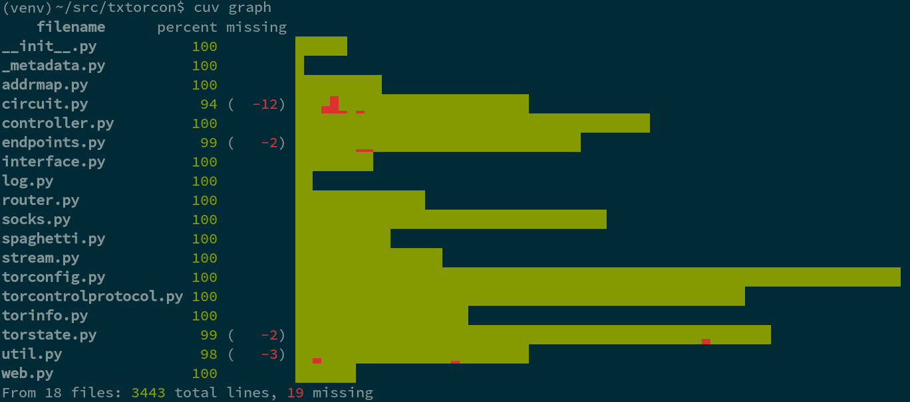
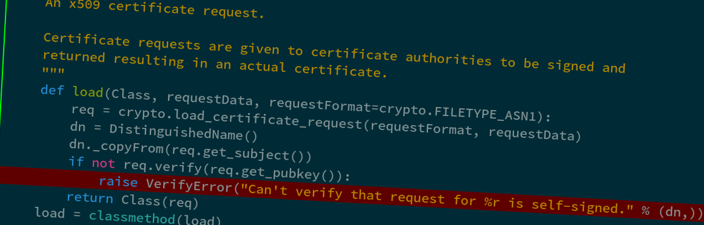
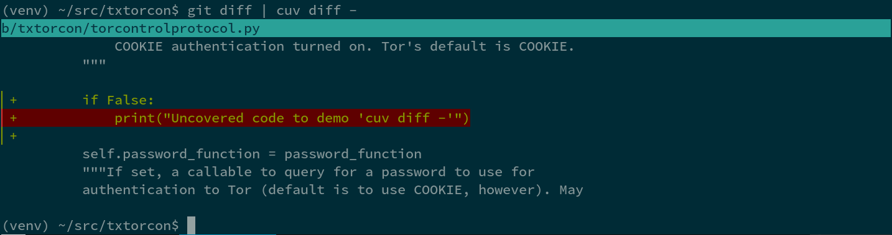
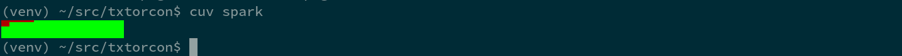

Cuv'ner
=======

"A commanding view of your test-coverage"

The command-line tool ``cuv`` provided by this package gives some
useful tools to visualize your project's coverage data. This means you
must first run `coverage`_ against your project's test-suite.

Once you have a ``.coverage`` file, you can use the commands
documented below (or just type ``cuv`` to explore the help).

We utilize several quality open-source packages to achieve this:

 - `coverage`_ by Ned Batchelder
 - `Click`_ by Armin Ronacher / pocoo
 - `pygments`_ by Georg Brandl / pocoo
 - `ansicolors`_ by Giorgos Verigakis
 - `unidiff`_ by Matias Bordese
 - `Source Code Pro`_: the best programming font

Code: https://github.com/meejah/cuvner
Docs: https://cuvner.readthedocs.org

Background + Terminology
------------------------

This started out as some experiments in "whole-project coverage
visualization", and then also grew some console tools that I find
useful when working with Python code.

I have abandoned the pixel/graphical visualization ideas and
proofs-of-concepts into a branch and now this tool is `just` the
console visualizations -- which are very useful when working on Python
code.

As far as my setup, I am using Debian with a 256-color and unicode
capable shell using Solarized Dark color schemes. There are probably
bugs with other setups, and to a reasonable extent I'm happy to accept
pull-reqeusts fixing these. That said, a unicode-capable shell is a
must.

Other Neat Visualizations
~~~~~~~~~~~~~~~~~~~~~~~~~

Other nice "coverage visualization" tools I've run across:

- of course, `Coverage.py
  <http://coverage.readthedocs.org/en/latest/>`_ itself comes with a
  nice HTML visualization
- `emacs-coverage <https://github.com/trezona-lecomte/coverage>`_
- `codecov.io browser extension
  <https://github.com/codecov/browser-extension>`_ shows coverage live
  while browsing github

Notes on Tox
------------

If you're using `tox`_ to run tests (and you should, it's great!) your
coverage files will -- depending upon setup -- end up in
``.tox/envname/.coverage`` or similar. So, you will either need to use
``--coverage`` to point cuv'ner at the right file, or simply move it to
the top-level of your project for ease-of-use.

Pro Tip(tm)
-----------

The "uncovered" lines start with a slightly different unicode
character than the "covered" lines, so if you're trying to write tests
for uncovered things, you can do this on the "next file that has
uncovered things":

``cuv src/file.py | less -p ▌ -j 4``

That says (since ``cuv lessopen`` is the "default" command) to run
``cuv lessopen`` on ``src/file.py`` and then , in less, jump to the
first uncovered line and place it 4 lines below the top of the
screen. You can then hit ``n`` in less to go to the next one.

This is precisely what the ``cuv next`` command does.

Console Visualizations
----------------------

The two main tools usable directly in the console are ``cuv graph``
and ``cuv lessopen`` (which can be tied directly into ``less`` via the
``LESSOPEN`` environment variable). For determining coverage of
branches or individual commits, use ``cuv diff``. ``cuv spark`` can
provide a quick overview of a project's coverage.

``cuv graph``
~~~~~~~~~~~~~

This displays all the files in your project and a histogram-like graph
of their coverage. Each character represents 8 lines of code, and uses
a group of unicode characters (0x2580 through 0x2587) to draw a little
graph. So, if those 8 lines are not covered at all, the graph will be
all red; if they're all covered, it will be all green. If 2 out of the
8 lines are covered, there will be about 25% green and the rest red.

The total size of each file can thus be easily seen (by the length of
the histogram part, which wraps to subsequent lines if needed) and an
idea of which parts are covered is given.

TODO:

 - testing on more terminal types
 - how does it look when using something besides Solarized Dark?
 - useful, beyond eye-candy?

``cuv lessopen``
~~~~~~~~~~~~~~~~

This command is intended to be used via the ``LESSOPEN`` environment
variable, which lets you pre-process files that are opened with
``less``. So, once set up (see the help via ``cuv lessopen --help``)
you can simply run ``less`` on any file in your project, and it will
get syntax-highlighted and show you the line-by-line coverage with a
leading green or red mini-verical bar and red background (for
uncovered lines).

A header appears at the top showing the total coverage for this
particular file.

TODO:

 - probably the "proper" way to do this is via a `Pygments`_ plugin or
   extension of some sort
 - option to change which `Pygments`_ style is used
 - dark/light background option?

``cuv diff``
~~~~~~~~~~~~

You can pipe a ``git diff`` to this and see a colorized version of the
diff in your console. I am using a library called `unidiff`_ to read
the actual diff, which so far works quite nicely. That said, I've only
tried against the output of Git, like so::

   git diff | cuv diff | less

TODO:

 - colors are unsatisfying, since for added lines they're pretty much
   the same as Git's colored output
 - maybe make it look more like the "real" underlying diff?
   (e.g. re-create the @@ and so forth things)
 - does it work with merge commits?

``cuv spark``
~~~~~~~~~~~~~

This shows a "spark-line" sort of thing in the console. It's not very
useful for big projects (e.g. Twisted), but gives a very quick
overview of the coverage in a small amount of space. Using the same
unicode characters as ``cuv graph``, this represents each file as a
single character, and its percentage coverage is graphed (so you only
get granularity down to about 12.5%).

.. _tox: https://tox.readthedocs.org/en/latest/
.. _coverage: https://coverage.readthedocs.org/en/latest/
.. _pygments: http://pygments.org/
.. _Twisted: https://twistedmatrix.org/
.. _txtorcon: https://meejah.ca/projects/txtorcon
.. _Click: http://click.pocoo.org/
.. _Source Code Pro: http://adobe-fonts.github.io/source-code-pro/
.. _ansicolors: https://github.com/verigak/colors/
.. _unidiff: https://github.com/matiasb/python-unidiff
