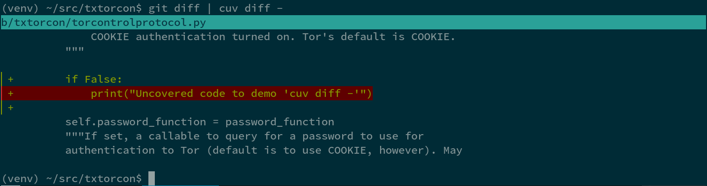

.. cuv'ner documentation master file, created by
   sphinx-quickstart on Fri Jan  8 02:37:26 2016.
   You can adapt this file completely to your liking, but it should at least
   contain the root `toctree` directive.

cuv'ner
=======

"A commanding view of your test-coverage".

The tool ``cuv`` provides console tools to show coverage data for you
Python project nicely in the console. It uses colour and unicode
characters.

``cuv`` can:

 - graph coverage of all files in your project;
 - colour-ize individual source-code files (via ``less``) by their coverage;
 - colour-ize ``diff`` (or e.g. ``git diff master..HEAD``) by coverage
 - diff ``.coverage`` files themselves

.. toctree::
   :maxdepth: 2

   README.rst

Command Documentation
---------------------

.. click_command:: cuv graph

.. image:: ../screenshots/cuvner-graph-twisted.png
    :alt: console graph, showing Twisted code

.. click_command:: cuv lessopen

.. image:: ../screenshots/cuvner-lessopen-twisted.png
    :alt: pygments + coverage coloring in console

.. click_command:: cuv diff

.. click_command:: cuv spark

.. click_command:: cuv readme
